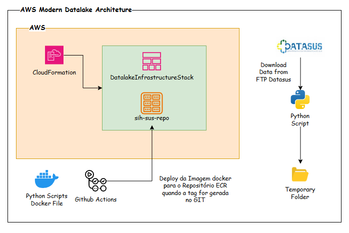

# AWS Modern Datalake - Version: 0.1.0

[](https://x.com/_brau_io)
[](https://www.docker.com/)
[](https://www.aws.amazon.com/)
[](./.github)
[](https://spring.io/)
[](https://www.postgresql.org/)
[](https://www.python.org/)
[](https://www.oracle.com/br/java)
[](https://maven.apache.org/)

Modern data lake architecture on AWS featuring S3, Glue ETL, Athena analytics, and BI visualization following raw, trusted, and refined layers.

AWS Modern Datalake is created and maintained by [Bráulio Figueiredo](https://brau.io).

## Table of Contents

- [Technologies](#technologies)
- [Architectural Model](#architectural-model)
- [AWS CloudFormation](#aws-cloudformation)
- [Docker](#docker)
- [SIH DATASUS DBC file structure](#sih-datasus-dbc-file-structure)
- [Versioning](#versioning)
- [Author](#author)

## Technologies

- Amazon AWS CDK
- Python 3.10+
- Maven 3.8+

## Architectural Model



*Figure: High-level architecture of the AWS Modern Datalake (data ingestion, storage layers, and analytics).*

## AWS CloudFormation

Infrastructure is defined with the AWS CDK (Cloud Development Kit) and deployed as CloudFormation stacks in the `aws-infrastructure` project.

The **DatalakeInfrastructureStack** creates an ECR repository named `sih-sus-repo` for storing the pipeline Docker image.

### Prerequisites

- [AWS CLI](https://aws.amazon.com/cli/) configured (`aws configure`)
- [Node.js](https://nodejs.org/) (for CDK CLI)
- [AWS CDK CLI](https://docs.aws.amazon.com/cdk/v2/guide/cli.html): `npm install -g aws-cdk`
- [Maven](https://maven.apache.org/) (for the Java CDK app)

### Deploy

From the **project root**:

```bash
cd aws-infrastructure

# First time only: bootstrap CDK in your account/region
cdk bootstrap

# Set account and region (e.g. via context or env)
# Option A: in cdk.json set "account" and "region" under "context"
# Option B: pass when deploying
cdk deploy DatalakeInfrastructureStack --context account=YOUR_ACCOUNT_ID --context region=us-east-1 --require-approval never
```

After deployment, the ECR repository `sih-sus-repo` is available in your account for pushing the Docker image (e.g. via GitHub Actions on tag push).

## Docker

You can run the pipeline (download SIH DBC, convert to DBF and CSV) using Docker.

### Prerequisites

- [Docker](https://docs.docker.com/get-docker/) installed
- Optional: create `python/src/.env` from `python/src/.env.example` to set FTP URL, paths, period and states (otherwise defaults are used)

### Option 1: Docker Compose

From the **project root**:

```bash
# Build and run
docker compose up --build

# Or run in background
docker compose up -d --build
docker compose logs -f
```

Compose uses `python/src/.env` (if present) and mounts `./tmp` so DBC, DBF and CSV files are written to your host. Period and states can be overridden in `docker-compose.yml` under `environment`.

### Option 2: Docker Run

From the **project root**:

```bash
# Build the image
docker build -t aws-modern-datalake:latest .

# Run (mount tmp so output is on the host; optional env file)
docker run --rm \
  -v "$(pwd)/tmp:/app/python/tmp" \
  --env-file python/src/.env \
  aws-modern-datalake:latest
```

On **Windows (PowerShell)**:

```powershell
docker run --rm `
  -v "${PWD}/tmp:/app/python/tmp" `
  --env-file python/src/.env `
  aws-modern-datalake:latest
```

If you omit `--env-file`, the app uses built-in defaults (see `python/src/config/env_loader.py`). You can also pass variables with `-e`, e.g. `-e FTP_DATASUS=ftp://ftp.datasus.gov.br`.

## SIH DATASUS DBC file structure

Files from the **SIH** (Sistema de Informações Hospitalares — Hospital Information System) on DATASUS FTP follow this naming pattern:

**`RD` + `UF` + `AAMM` + `.dbc`**

| Part | Description |
|------|-------------|
| **RD** | Fixed prefix for the SIH dataset |
| **UF** | Two-letter Brazilian state code (e.g. SP, RJ, MG) |
| **AAMM** | Reference period: **AA** = two-digit year, **MM** = two-digit month |

### Examples

| File | State | Period |
|------|-------|--------|
| `RDSP2301.dbc` | São Paulo | January 2023 |
| `RDRJ2301.dbc` | Rio de Janeiro | January 2023 |
| `RDMG2301.dbc` | Minas Gerais | January 2023 |

## Versioning

AWS Modern Datalake "Semantic Versioning" guidelines whenever possible.
Updates are numbered as follows:

`<major>.<minor>.<patch>`

Built on the following guidelines:

* Breaking compatibility with the previous version will be updated in "major"
* New implementations and features in "minor"
* Bug fixes in "patch"

For more information about SemVer, please visit http://semver.org.

## Author
- Email: braulio@braulioti.com.br
- X: https://x.com/_brau_io
- GitHub: https://github.com/braulioti
- Website: https://brau.io      
